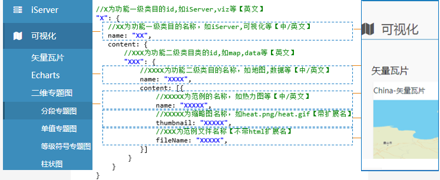

https://gerhardyang.github.io/SuperMapCesiumDemo


<h3 id="example-1">目录结构</h3>

范例目录结构：
``` 
            ./
              └─3dwebgl         3dwebgl范例目录
                  ├─img             缩略图目录
                  └─config.js       配置文件  
              ├─Cesium       SuperMap Cesium库
              ├─css         公共css目录
              ├─fonts       公共字体目录
              ├─img         公共图片目录
              ├─js          公共js目录
              ├─libs        公共依赖
              ├─locales     语言包
              │─template    界面模板
              
  
  
```

<h3 id="example-5">配置文件</h3> 
    
 每个客户端范例目录(如：`/example/leaflet`)下都有一个`config.js`文件，文件在站点初始化时读取。
 
 `config.js`中范例相关的配置项为`exampleConfig`，参数如下：
 
 左边为侧边栏菜单，右边为示例列表
 
 


                               


  

